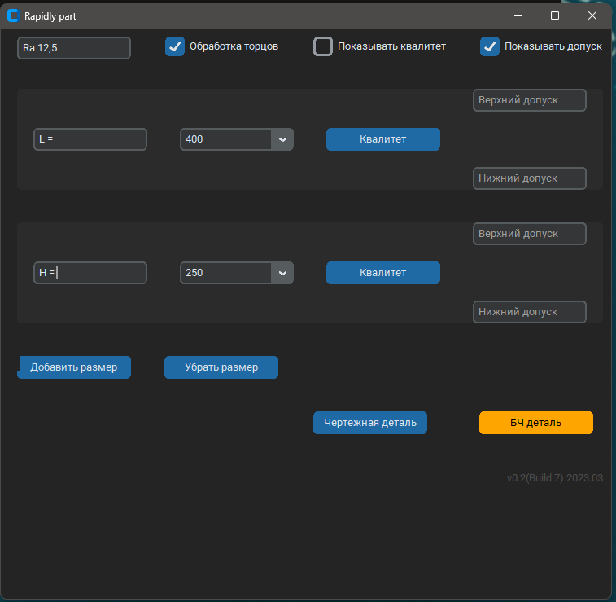

# Rapidly Part - Описание

Rapidly Part - Предназначен для быстрого заполнения свойств детали Kompas-3D, для преобразования детали в
безчертежную деталь.
---
Работа макроса проверялась на Kompas-3D v19.

Работа макроса возможна запуском как отдельного приложения через exe файл, так и закрепления ссылки в самом Kompas-3D на панели свойств.
Но рекомендуется вынести ссылку на панель Kompas-3D (см. раздел Закрепление на панели инструментов).

---
## Интерфейс и возможности

Возможности макроса:
* Автоматическое заполнение Формата листа (БЧ)
* Подстановка материала из свойств детали
* Подстановка размеров из габаритов детали
* Заполнение шероховатости обработки торцев детали
* Указание нескольких габаритов детали, например для листа.
* Возврат к чертежной детали
---

## Работа с макросом

<h3>

<i>
Заполненные свойства не являются ссылками, поэтому при изменении габаритов, массы или материала необходимо запустить 
макрос и заново заполнить все свойства
</i>

</h3>

Для заполнения свойств:

* Выберети необходимое количество размеров для детали кнопками "Добавить размер", "Убрать размер"
* Выберети значения размеров из выпадающего списка (соответствуют габаритам детали) или выпишите свое значение
* Выберети Квалитет и допуска для размера по необходимости
* Для указания шероховатости обработки торцев нажмите галочку обработка торцев и впишите
* Нажмите кнопку "БЧ деталь", что бы заполнить свойства

* Для возврата к чертежной детали, запустите макрос и нажмите "Чертежная деталь"

---
## Закрепление на панели инструментов

Для закрепления файла на панели инструментов необходимо:
* Распаковать архив с макросом в любую удобную для Вас папку.
* Запустить Kompas-3D
* Открыть "Конфигуратор"

* Добавить Утилиту, выбрав до нее путь

* Расположить иконку макроса на панели инструментов, настроив интерфейс.
* Кликнуть правой кнопкой мыши по панели 
инструметов и выбрать "Настроить интерфейс..."

* Выбрать раздел "Утилиты"

* Перенести иконку на панель инструметов

---

